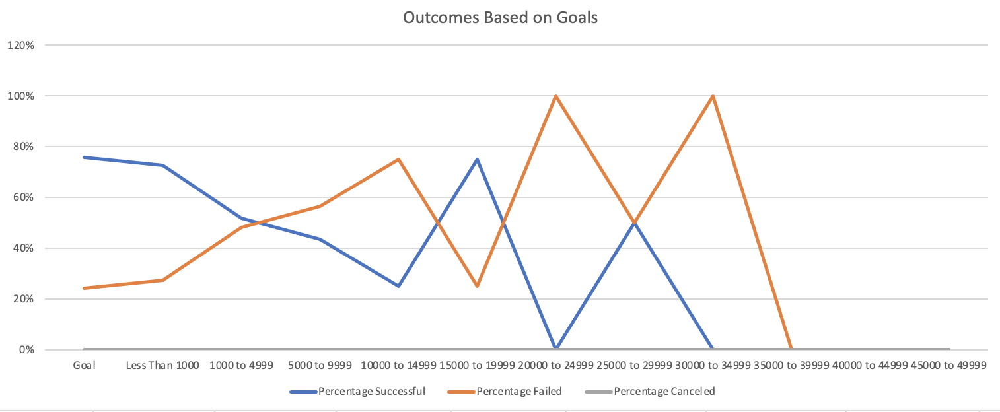

# kickstarter-analysis

Performing analysis on Kickstarter data to uncover trends

## Overview of Project 

### Purpose

Louise is an upcoming playwriter who is looking to fund her play, "Fever." She is estimating a high budget of around $12,000 and is hesitant to start her campaign. The purpose of this project is to help Louise uncover trends that make a successful campaign. Data was compiled into a crowdfunding platform titled Kickstarter where over 4,000 campaigns are listed. These campaigns have raised money for projects similar to Louise's project. Using Excel, we analyzed the data to identify the trends and factors that made an event either successful, failed, or cancelled. The analysis was tailored to specifically focus on theatrical plays in order to give Louise the best analysis on creating a successful campaign for her play. 

## Analysis and Challenges

### Analysis of Outcomes Based on Launch Date

The chart above depicts the success of similar theater plays dependent on the month of the year. Louise will get a sense of when is the best time to launch her campaign throughout the year. It is evident the best months to launch a campaign would be in April through August as similar plays experienced success those months. More specifically, acording to the data, May and June would be the absolute best months to launch her campaign. 

### Analysis of Outcomes Based on Goals

The table above uses the COUNTIFS function of excel to display the Outcomes Based on Goals in a line graph. By doing so, we are able to gather data on successful, failed and canceled events. The data reveals 0% of events were canceled. The data was filtered out by Parent Category and years in order to show Louise the best outcomes on projected goals by similar plays. Above are the results of the pivot table and line chart. 

### Challenges and Difficulties Encountered

Some challenges and difficulties encountered in performing the data anaylsis was in creating formulas to analyze the number of successful, failed, and canceled plays. The COUNTIFS formula was a lengthy formula that required a meticulous amount of time to perfect. At one point, I missed an extra space in the formula and it took me time to discover this. With the help of asking the class, I was able to identify the extra space and correct the error.

I, also, expereienced some diffulty in creating the chart for the Outcomes Based on Goals pivot table. The x-axis was not displaying the goals correctly. The x-axis was reading numbers 1, 2,3,4 etc instead of displaying the goals. I had to troubleshoot this by exploring the Excel Chart Design options. Later, I confirmed via a google search to make sure I was editing the chart appropriately.

## Results

- What are two conclusions you can draw about the Outcomes based on Launch Date?
- When looking at the data, it is clear the best month to lauch a campaign would be in May. We see the number of successful theatrical plays thrive in the months of May and June. I would advise Louise to work on the details of her campaign during the Fall Months in preparation form a late spring and early summer launch. The months of Novement and Decembers, have patterns of a low success rate. I would use this time to plan and organize. 

- What can you conclude about the Outcomes based on Goals?
- According to the data on the Outcomes based on Goals, we found that plays with goals of less than a 1000 experienced success. There were a total of 8 outliers that experiences success with goals between the 15000 to 24999 range. This is a small amount in comparison to the total number of successful projects. I would advise Louise to aim for a smaller goal in order to experience success early on in her campaign and then building upon that success later. 

- What are some limitations of this dataset?
- I think some limitations of this dataset are the outlier plays. These plays experienced success with very high goals. This skews the data to the right. We discovered this when we analyzed the descriptive statistics. We found the mean is much higher than the median when it came to both successful and failed plays. Therefore, the data analyzed was not an even, symmetrical bell curve. 

- What are some other possible tables and/or graphs that we could create?
- Some other possible tables/graphs we could create would be to look at the relationship between successful plays and how much was donated to those specific plays. We can use data from the backers and pledged columns to determing this information. This would help us get a sense of the amount of resources needed to make a play successful. We could also filter and analyze the plays based on people's interest. We can do this by creating a pivot table to compare the blurb section of each play and the success rate. 

